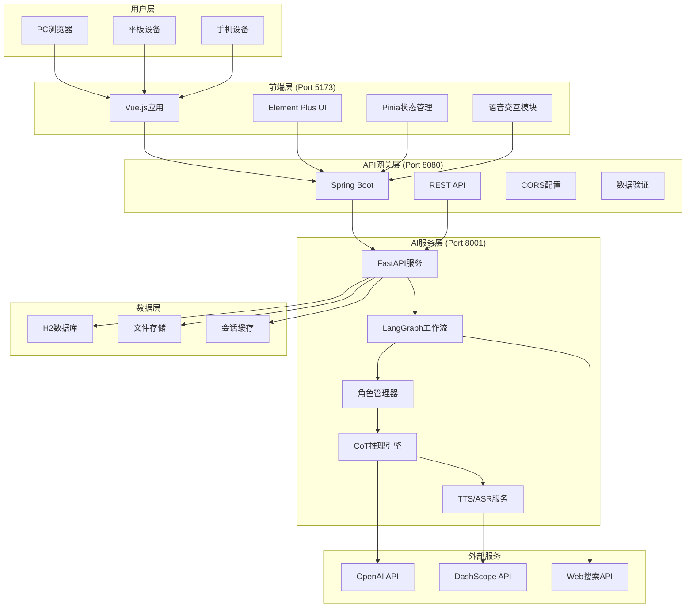

# FamilyBot 架构设计文档

<div align="center">
  <h1>🏠 AI家庭陪伴系统</h1>
  <h2>架构设计与技术规格说明</h2>
  <p><strong>版本:</strong> v1.0 | <strong>更新时间:</strong> 2025-09-28</p>
</div>

---

## 📋 目录

1. [项目概述](#1-项目概述)
2. [需求分析](#2-需求分析)
3. [系统架构](#3-系统架构)
4. [模块规格](#4-模块规格)
5. [技术栈](#5-技术栈)
6. [接口设计](#6-接口设计)
7. [数据库设计](#7-数据库设计)
8. [部署架构](#8-部署架构)
9. [测试策略](#9-测试策略)
10. [团队分工](#10-团队分工)
11. [开发规范](#11-开发规范)

---

## 1. 项目概述

### 1.1 项目简介

FamilyBot是一个专为留守老人设计的AI家庭陪伴系统，通过先进的AI技术模拟家庭成员，为老年人提供情感陪伴、健康咨询、日常交流等服务。

### 1.2 核心价值

- **情感陪伴**: 缓解老年人孤独感，提供心理支持
- **健康管理**: 专业的健康建议和日常生活指导
- **智能交互**: 支持语音和文字多模态交互
- **个性化服务**: 根据用户偏好提供定制化服务

### 1.3 创新亮点

- 🎭 **多角色AI**: 三个不同性格的虚拟家庭成员
- 🧠 **CoT推理**: Chain of Thought深度思考能力
- 🔍 **GraphRAG**: 基于知识图谱的智能检索
- 🎙️ **多模态**: 语音识别、TTS、文本交互
- 📚 **文档学习**: 上传文档构建角色知识库

---

## 2. 需求分析

### 2.1 功能需求

#### 2.1.1 核心功能
- **角色选择**: 用户可选择不同的虚拟家庭成员对话
- **智能对话**: 基于上下文的自然语言对话
- **语音交互**: 语音输入和TTS语音回复
- **文档上传**: 上传个人文档建立专属知识库
- **会话管理**: 对话历史保存和回顾

#### 2.1.2 角色设定
- **喜羊羊（儿子，28岁）**: 理性稳重，擅长健康建议和生活指导
- **美羊羊（女儿，25岁）**: 温柔体贴，提供情感支持和贴心关怀
- **懒羊羊（孙子，8岁）**: 天真烂漫，带来童趣和欢乐

#### 2.1.3 高级功能
- **情感识别**: 识别用户情绪状态，调整回应策略
- **意图路由**: 智能判断最适合处理请求的角色
- **知识检索**: 基于用户上传文档的个性化回答
- **联网搜索**: 获取实时信息和最新资讯

### 2.2 非功能需求

#### 2.2.1 性能要求
- **响应时间**: 对话响应时间 < 3秒
- **并发用户**: 支持100+并发用户
- **系统可用性**: 99.5%以上
- **语音延迟**: TTS生成延迟 < 2秒

#### 2.2.2 安全要求
- **数据加密**: 用户数据传输和存储加密
- **隐私保护**: 用户对话记录本地存储
- **访问控制**: 基于用户身份的权限管理
- **API安全**: 接口鉴权和防护

#### 2.2.3 可用性要求
- **界面友好**: 适老化UI设计
- **操作简单**: 最少步骤完成核心功能
- **多终端**: 支持PC、平板、手机等设备
- **语音优先**: 考虑老年人使用习惯

---

## 3. 系统架构

### 3.1 整体架构



### 3.2 架构特点

#### 3.2.1 分层架构
- **表现层**: Vue.js前端，负责用户交互
- **业务层**: Spring Boot后端，处理业务逻辑
- **服务层**: AI Agent，提供智能服务
- **数据层**: 数据库和文件存储

#### 3.2.2 微服务设计
- **服务解耦**: 前端、后端、AI服务独立部署
- **接口标准**: RESTful API和内部RPC调用
- **容错处理**: 服务间降级和重试机制
- **负载均衡**: 支持水平扩展

#### 3.2.3 集成模式
```
前端 (5173) ←→ 后端 (8080) ←→ AI Agent (8001, 内部)
```
- 前端只需调用后端统一API
- 后端代理所有AI服务调用
- AI Agent不对外暴露，提高安全性

---

## 4. 模块规格

### 4.1 前端模块 (frontend/)

#### 4.1.1 技术栈
- **框架**: Vue 3.4 + Composition API
- **UI库**: Element Plus 2.4
- **状态管理**: Pinia 2.1
- **路由**: Vue Router 4.2
- **构建工具**: Vite 5.0
- **HTTP客户端**: Axios 1.6

#### 4.1.2 目录结构
```
frontend/
├── src/
│   ├── components/          # 公共组件
│   │   ├── CharacterSelector.vue    # 角色选择器
│   │   ├── ConversationSidebar.vue  # 会话侧边栏
│   │   └── VoiceRecorder.vue        # 语音录制组件
│   ├── views/               # 页面组件
│   │   ├── ChatView.vue             # 主聊天页面
│   │   └── SettingsView.vue         # 设置页面
│   ├── stores/              # 状态管理
│   │   ├── chat.js                  # 聊天状态
│   │   └── user.js                  # 用户状态
│   ├── api/                 # API接口
│   │   └── familybot.js             # 后端接口
│   ├── router/              # 路由配置
│   │   └── index.js
│   ├── assets/              # 静态资源
│   └── main.js              # 应用入口
├── public/                  # 公共资源
└── package.json            # 项目配置
```

#### 4.1.3 核心功能模块

**1. 角色选择模块**
- 展示三个虚拟家庭成员
- 角色切换和状态管理
- 角色特性和语音配置

**2. 对话交互模块**
- 实时消息发送和接收
- 消息类型处理（文本/语音/图片）
- 对话历史展示和滚动

**3. 语音处理模块**
- 语音录制和播放
- TTS音频播放
- 语音识别状态管理
- 麦克风权限管理

**4. 会话管理模块**
- 会话列表展示
- 会话切换和删除
- 本地存储管理

### 4.2 后端模块 (backend/)

#### 4.2.1 技术栈
- **框架**: Spring Boot 3.5.6
- **数据库**: H2 Database (开发), MySQL (生产)
- **ORM**: Spring Data JPA
- **安全**: Spring Security
- **文档**: Swagger/OpenAPI
- **构建**: Maven 3.6+

#### 4.2.2 目录结构
```
backend/src/main/java/cn/qiniu/familybot/
├── controller/              # 控制器层
│   └── FamilyBotController.java
├── service/                 # 业务服务层
│   ├── FamilyBotService.java
│   ├── AIAgentService.java
│   └── DataInitService.java
├── model/                   # 数据模型
│   ├── User.java
│   ├── Character.java
│   └── Conversation.java
├── repository/              # 数据访问层
│   ├── UserRepository.java
│   ├── CharacterRepository.java
│   └── ConversationRepository.java
├── dto/                     # 数据传输对象
│   ├── ChatRequest.java
│   ├── ChatResponse.java
│   ├── CharacterDTO.java
│   └── UserDTO.java
├── config/                  # 配置类
│   ├── AppConfig.java
│   ├── CorsConfig.java
│   ├── WebConfig.java
│   └── DataInitializer.java
└── FamilyBotApplication.java
```

#### 4.2.3 核心功能模块

**1. API控制器 (Controller)**
- `/api/v1/chat` - 聊天接口
- `/api/v1/characters` - 角色管理
- `/api/v1/conversations` - 会话管理
- `/api/v1/upload` - 文件上传

**2. 业务服务 (Service)**
- `FamilyBotService` - 核心业务逻辑
- `AIAgentService` - AI服务代理
- `DataInitService` - 数据初始化

**3. 数据模型 (Model)**
- `User` - 用户信息
- `Character` - 角色定义
- `Conversation` - 对话记录

### 4.3 AI Agent模块 (ai_agent/)

#### 4.3.1 技术栈
- **框架**: FastAPI 0.104
- **AI框架**: LangGraph, LangChain
- **大模型**: OpenAI GPT-4, Qwen
- **向量数据库**: ChromaDB
- **语音服务**: OpenAI TTS, DashScope ASR
- **知识图谱**: NetworkX
- **文档处理**: PyPDF2, python-docx

#### 4.3.2 目录结构
```
ai_agent/
├── main.py                  # 应用入口
├── config.py               # 配置管理
├── agents/                 # 角色代理
│   └── character_agent.py
├── graph/                  # 工作流图
│   ├── conversation_graph.py
│   └── router.py
├── services/               # 核心服务
│   └── audio_service.py
├── reasoning/              # 推理模块
│   ├── cot_reasoning.py
│   └── intent_router.py
├── rag/                    # 检索增强
│   ├── graph_rag.py
│   ├── vector_store.py
│   └── document_processor.py
├── memory/                 # 记忆系统
│   ├── conversation_memory.py
│   └── user_profile.py
├── tools/                  # 工具模块
│   ├── web_search.py
│   └── document_tools.py
├── models/                 # 数据模型
│   ├── chat_models.py
│   └── rag_models.py
├── prompts/                # 提示词模板
│   ├── character_prompts.py
│   └── cot_prompts.py
└── data/                   # 数据文件
    ├── characters/
    ├── documents/
    └── embeddings/
```

#### 4.3.3 核心功能模块

**1. 角色代理系统 (Agents)**
- `CharacterAgent` - 角色基类
- 角色特性和行为定义
- 个性化回复生成
- 情感状态管理

**2. 对话工作流 (Graph)**
- `ConversationGraph` - 主工作流
- `IntentRouter` - 意图路由器
- 多角色协作机制
- 上下文状态管理

**3. 推理引擎 (Reasoning)**
- `CoTReasoning` - 思维链推理
- 5步思考流程
- 决策树生成
- 推理结果评估

**4. 检索增强 (RAG)**
- `GraphRAG` - 知识图谱检索
- `VectorStore` - 向量搜索
- `DocumentProcessor` - 文档处理
- 个性化知识库

**5. 音频服务 (Audio)**
- TTS语音生成（三种不同音色）
- ASR语音识别
- 音频格式转换
- 实时语音处理

### 4.4 测试模块 (tests/)

#### 4.4.1 测试类型
- **单元测试**: 各模块功能测试
- **集成测试**: 模块间接口测试
- **端到端测试**: 完整流程测试
- **性能测试**: 响应时间和并发测试

#### 4.4.2 测试文件
```
tests/
├── test_ai_agent.py         # AI Agent测试
├── test_chat_roles.py       # 角色对话测试
├── test_cot_system.py       # CoT推理测试
├── test_voice_ai.py         # 语音功能测试
├── test_full_system.py      # 系统集成测试
├── test_pdf_upload.py       # 文档上传测试
└── README.md               # 测试说明
```

---

## 5. 技术栈

### 5.1 前端技术栈

| 技术类别 | 技术选型 | 版本 | 用途说明 |
|---------|---------|------|---------|
| 前端框架 | Vue.js | 3.4+ | 组件化开发，响应式UI |
| UI组件库 | Element Plus | 2.4+ | 企业级UI组件 |
| 状态管理 | Pinia | 2.1+ | 轻量级状态管理 |
| 路由管理 | Vue Router | 4.2+ | 单页应用路由 |
| 构建工具 | Vite | 5.0+ | 快速构建和热重载 |
| HTTP客户端 | Axios | 1.6+ | API请求处理 |
| 样式预处理 | CSS3 | - | 原生CSS变量和Grid |
| 时间处理 | Moment.js | 2.29+ | 日期时间格式化 |

### 5.2 后端技术栈

| 技术类别 | 技术选型 | 版本 | 用途说明 |
|---------|---------|------|---------|
| 开发语言 | Java | 17+ | 企业级开发语言 |
| 应用框架 | Spring Boot | 3.5.6 | 微服务框架 |
| 数据访问 | Spring Data JPA | 3.5+ | ORM框架 |
| 数据库 | H2/MySQL | 8.0+ | 内存数据库/关系数据库 |
| 安全框架 | Spring Security | 6.0+ | 认证授权 |
| API文档 | Swagger | 3.0+ | 接口文档生成 |
| 构建工具 | Maven | 3.6+ | 项目构建管理 |
| 应用服务器 | Tomcat | 10.0+ | Web服务器 |

### 5.3 AI服务技术栈

| 技术类别 | 技术选型 | 版本 | 用途说明 |
|---------|---------|------|---------|
| 开发语言 | Python | 3.10+ | AI开发首选语言 |
| Web框架 | FastAPI | 0.104+ | 高性能异步API框架 |
| AI框架 | LangChain | 0.1+ | LLM应用开发框架 |
| 工作流 | LangGraph | 0.0.35+ | 多Agent工作流 |
| 大语言模型 | OpenAI GPT-4 | API | 主要推理模型 |
| 国产模型 | Qwen | 通义千问 | 备用推理模型 |
| 向量数据库 | ChromaDB | 0.4+ | 文档向量存储 |
| 语音服务 | OpenAI TTS | API | 文字转语音 |
| 语音识别 | DashScope ASR | API | 语音转文字 |
| 文档处理 | PyPDF2 | 3.0+ | PDF文档解析 |
| 知识图谱 | NetworkX | 3.0+ | 图数据结构 |

### 5.4 部署运维技术栈

| 技术类别 | 技术选型 | 版本 | 用途说明 |
|---------|---------|------|---------|
| 操作系统 | Ubuntu/CentOS | 20.04+ | 服务器系统 |
| 容器化 | Docker | 20.0+ | 应用容器化 |
| 容器编排 | Docker Compose | 2.0+ | 多容器管理 |
| 反向代理 | Nginx | 1.20+ | 负载均衡和静态文件 |
| 进程管理 | PM2 | 5.0+ | Node.js进程管理 |
| 日志管理 | ELK Stack | 8.0+ | 日志收集分析 |
| 监控告警 | Prometheus | 2.40+ | 系统监控 |

---

## 6. 接口设计

### 6.1 API设计原则

#### 6.1.1 RESTful规范
- 使用标准HTTP方法（GET, POST, PUT, DELETE）
- 资源导向的URL设计
- 统一的响应格式
- 合理的HTTP状态码

#### 6.1.2 接口版本管理
- URL版本控制：`/api/v1/`
- 向后兼容性保证
- 版本废弃通知机制

#### 6.1.3 安全设计
- HTTPS强制传输
- API Key认证
- 请求频率限制
- 数据验证和过滤

### 6.2 主要API接口

#### 6.2.1 聊天接口

**请求**
```http
POST /api/v1/chat
Content-Type: application/json

{
    "userId": "string",
    "characterId": "xiyang|meiyang|lanyang",
    "message": "string",
    "messageType": "text|voice",
    "threadId": "string",
    "voiceConfig": {
        "voice": "string",
        "speed": 1.0
    }
}
```

**响应**
```http
HTTP/1.1 200 OK
Content-Type: application/json

{
    "success": true,
    "data": {
        "characterId": "string",
        "characterName": "string",
        "response": "string",
        "emotion": "string",
        "audioBase64": "string",
        "audioUrl": "string",
        "timestamp": "2025-09-28T21:00:00Z"
    },
    "error": null
}
```

#### 6.2.2 角色管理接口

**获取角色列表**
```http
GET /api/v1/characters
```

**获取角色问候语**
```http
GET /api/v1/characters/{characterId}/greeting
```

**切换当前角色**
```http
POST /api/v1/characters/{characterId}/switch
```

#### 6.2.3 会话管理接口

**获取会话列表**
```http
GET /api/v1/conversations?userId={userId}&limit=20&offset=0
```

**创建新会话**
```http
POST /api/v1/conversations
{
    "userId": "string",
    "characterId": "string",
    "title": "string"
}
```

**删除会话**
```http
DELETE /api/v1/conversations/{conversationId}
```

#### 6.2.4 文档上传接口

**上传文档**
```http
POST /api/v1/upload-document
Content-Type: multipart/form-data

{
    "file": File,
    "userId": "string",
    "characterId": "string",
    "description": "string"
}
```

### 6.3 内部服务接口

#### 6.3.1 AI Agent内部接口

```
POST http://localhost:8001/chat
POST http://localhost:8001/voice-chat
GET  http://localhost:8001/characters/{id}/greeting
POST http://localhost:8001/upload-document
GET  http://localhost:8001/health
```

### 6.4 响应格式规范

#### 6.4.1 成功响应
```json
{
    "success": true,
    "data": {
        // 具体数据
    },
    "message": "操作成功",
    "timestamp": "2025-09-28T21:00:00Z"
}
```

#### 6.4.2 错误响应
```json
{
    "success": false,
    "error": {
        "code": "ERROR_CODE",
        "message": "错误描述",
        "details": "详细错误信息"
    },
    "timestamp": "2025-09-28T21:00:00Z"
}
```

---

## 7. 数据库设计

### 7.1 数据库选型

#### 7.1.1 关系数据库
- **开发环境**: H2 内存数据库
- **生产环境**: MySQL 8.0+
- **用途**: 用户数据、会话记录、系统配置

#### 7.1.2 文档数据库
- **ChromaDB**: 向量数据存储
- **用途**: 文档嵌入、语义搜索

### 7.2 数据表设计

#### 7.2.1 用户表 (users)
```sql
CREATE TABLE users (
    id BIGINT AUTO_INCREMENT PRIMARY KEY,
    username VARCHAR(50) UNIQUE NOT NULL,
    email VARCHAR(100),
    phone VARCHAR(20),
    avatar_url VARCHAR(255),
    preferences JSON,
    created_at TIMESTAMP DEFAULT CURRENT_TIMESTAMP,
    updated_at TIMESTAMP DEFAULT CURRENT_TIMESTAMP ON UPDATE CURRENT_TIMESTAMP,
    is_active BOOLEAN DEFAULT TRUE
);
```

#### 7.2.2 角色表 (characters)
```sql
CREATE TABLE characters (
    id VARCHAR(20) PRIMARY KEY,
    name VARCHAR(50) NOT NULL,
    role VARCHAR(20) NOT NULL,
    age VARCHAR(10),
    personality TEXT,
    avatar_url VARCHAR(255),
    voice_config JSON,
    system_prompt TEXT,
    greeting TEXT,
    created_at TIMESTAMP DEFAULT CURRENT_TIMESTAMP,
    is_active BOOLEAN DEFAULT TRUE
);
```

#### 7.2.3 会话表 (conversations)
```sql
CREATE TABLE conversations (
    id BIGINT AUTO_INCREMENT PRIMARY KEY,
    user_id BIGINT NOT NULL,
    character_id VARCHAR(20) NOT NULL,
    title VARCHAR(100),
    messages JSON,
    last_message_at TIMESTAMP,
    created_at TIMESTAMP DEFAULT CURRENT_TIMESTAMP,
    updated_at TIMESTAMP DEFAULT CURRENT_TIMESTAMP ON UPDATE CURRENT_TIMESTAMP,
    is_active BOOLEAN DEFAULT TRUE,
    FOREIGN KEY (user_id) REFERENCES users(id),
    FOREIGN KEY (character_id) REFERENCES characters(id)
);
```

#### 7.2.4 文档表 (documents)
```sql
CREATE TABLE documents (
    id BIGINT AUTO_INCREMENT PRIMARY KEY,
    user_id BIGINT NOT NULL,
    character_id VARCHAR(20),
    filename VARCHAR(255) NOT NULL,
    original_name VARCHAR(255),
    file_type VARCHAR(20),
    file_size BIGINT,
    file_path VARCHAR(500),
    summary TEXT,
    metadata JSON,
    created_at TIMESTAMP DEFAULT CURRENT_TIMESTAMP,
    FOREIGN KEY (user_id) REFERENCES users(id),
    FOREIGN KEY (character_id) REFERENCES characters(id)
);
```

### 7.3 索引设计

```sql
-- 用户相关索引
CREATE INDEX idx_users_username ON users(username);
CREATE INDEX idx_users_email ON users(email);

-- 会话相关索引
CREATE INDEX idx_conversations_user_id ON conversations(user_id);
CREATE INDEX idx_conversations_character_id ON conversations(character_id);
CREATE INDEX idx_conversations_last_message_at ON conversations(last_message_at);

-- 文档相关索引
CREATE INDEX idx_documents_user_id ON documents(user_id);
CREATE INDEX idx_documents_character_id ON documents(character_id);
CREATE INDEX idx_documents_created_at ON documents(created_at);
```

---

## 8. 部署架构

### 8.1 部署环境

#### 8.1.1 开发环境
```
本地开发 (localhost)
├── 前端: http://localhost:5173
├── 后端: http://localhost:8080
├── AI Agent: http://localhost:8001
└── 数据库: H2 内存数据库
```

#### 8.1.2 生产环境
```
生产服务器 (familybot.com)
├── 前端: https://familybot.com
├── 后端: https://api.familybot.com
├── AI Agent: 内部服务 (不对外)
└── 数据库: MySQL 集群
```

### 8.2 容器化部署

#### 8.2.1 Docker配置

**前端Dockerfile**
```dockerfile
FROM node:18-alpine
WORKDIR /app
COPY package*.json ./
RUN npm install
COPY . .
RUN npm run build
FROM nginx:alpine
COPY --from=0 /app/dist /usr/share/nginx/html
COPY nginx.conf /etc/nginx/nginx.conf
EXPOSE 80
```

**后端Dockerfile**
```dockerfile
FROM openjdk:17-jdk-slim
WORKDIR /app
COPY target/familybot-*.jar app.jar
EXPOSE 8080
ENTRYPOINT ["java", "-jar", "app.jar"]
```

**AI Agent Dockerfile**
```dockerfile
FROM python:3.10-slim
WORKDIR /app
COPY requirements.txt .
RUN pip install -r requirements.txt
COPY . .
EXPOSE 8001
CMD ["uvicorn", "main:app", "--host", "0.0.0.0", "--port", "8001"]
```

#### 8.2.2 Docker Compose配置

```yaml
version: '3.8'
services:
  frontend:
    build: ./frontend
    ports:
      - "5173:80"
    depends_on:
      - backend
    
  backend:
    build: ./backend
    ports:
      - "8080:8080"
    environment:
      - SPRING_PROFILES_ACTIVE=prod
      - DATABASE_URL=jdbc:mysql://db:3306/familybot
    depends_on:
      - db
      - ai-agent
    
  ai-agent:
    build: ./ai_agent
    ports:
      - "127.0.0.1:8001:8001"
    environment:
      - OPENAI_API_KEY=${OPENAI_API_KEY}
      - DASHSCOPE_API_KEY=${DASHSCOPE_API_KEY}
    volumes:
      - ./ai_agent/data:/app/data
    
  db:
    image: mysql:8.0
    environment:
      - MYSQL_ROOT_PASSWORD=${DB_ROOT_PASSWORD}
      - MYSQL_DATABASE=familybot
    volumes:
      - mysql_data:/var/lib/mysql
    ports:
      - "3306:3306"
    
  nginx:
    image: nginx:alpine
    ports:
      - "80:80"
      - "443:443"
    volumes:
      - ./nginx.conf:/etc/nginx/nginx.conf
      - ./ssl:/etc/nginx/ssl
    depends_on:
      - frontend
      - backend

volumes:
  mysql_data:
```

### 8.3 自动化部署

#### 8.3.1 部署脚本

**一键启动脚本 (start-all.sh)**
```bash
#!/bin/bash
echo "🚀 启动FamilyBot完整系统..."

# 启动数据库
echo "📊 启动数据库..."
docker-compose up -d db

# 等待数据库就绪
sleep 10

# 启动AI Agent
echo "🤖 启动AI Agent..."
docker-compose up -d ai-agent

# 等待AI Agent就绪
sleep 5

# 启动后端
echo "⚙️ 启动后端服务..."
docker-compose up -d backend

# 等待后端就绪
sleep 10

# 启动前端
echo "🎨 启动前端服务..."
docker-compose up -d frontend

# 启动反向代理
echo "🌐 启动Nginx..."
docker-compose up -d nginx

echo "✅ 系统启动完成!"
echo "🔗 访问地址: http://localhost"
```

#### 8.3.2 健康检查

```bash
#!/bin/bash
# health-check.sh
echo "🏥 系统健康检查..."

# 检查服务状态
services=("db" "ai-agent" "backend" "frontend" "nginx")
for service in "${services[@]}"; do
    if docker-compose ps $service | grep -q "Up"; then
        echo "✅ $service: 运行正常"
    else
        echo "❌ $service: 运行异常"
    fi
done

# 检查API健康
echo "🔍 检查API健康状态..."
curl -f http://localhost:8080/health || echo "❌ 后端API异常"
curl -f http://localhost:8001/health || echo "❌ AI Agent异常"
```

### 8.4 监控和日志

#### 8.4.1 日志配置

**应用日志目录**
```
logs/
├── frontend.log         # 前端访问日志
├── backend.log          # 后端应用日志
├── ai_agent.log         # AI服务日志
├── nginx_access.log     # Nginx访问日志
├── nginx_error.log      # Nginx错误日志
└── mysql_error.log      # MySQL错误日志
```

#### 8.4.2 监控指标

**系统指标**
- CPU使用率
- 内存使用率
- 磁盘使用率
- 网络流量

**应用指标**
- API响应时间
- 请求成功率
- 并发用户数
- TTS生成时间

---

## 9. 测试策略

### 9.1 测试金字塔

```
    /\
   /  \     E2E测试 (10%)
  /____\    ├── 端到端用户场景
 /      \   └── 浏览器自动化测试
/________\  
           集成测试 (20%)
           ├── API接口测试
           ├── 数据库集成测试
           └── 服务间通信测试
           
           单元测试 (70%)
           ├── 前端组件测试
           ├── 后端业务逻辑测试
           └── AI模块功能测试
```

### 9.2 测试类型

#### 9.2.1 单元测试

**前端单元测试**
- 组件渲染测试
- 事件处理测试
- 状态管理测试
- 工具函数测试

**后端单元测试**
- Service层业务逻辑测试
- Repository层数据访问测试
- 工具类和辅助方法测试
- 配置类测试

**AI Agent单元测试**
- 角色代理功能测试
- 推理引擎逻辑测试
- RAG检索准确性测试
- 音频处理功能测试

#### 9.2.2 集成测试

**API集成测试**
```python
# test_api_integration.py
def test_chat_flow():
    # 1. 选择角色
    response = client.get("/api/v1/characters")
    assert response.status_code == 200
    
    # 2. 发送消息
    response = client.post("/api/v1/chat", json={
        "userId": "test_user",
        "characterId": "xiyang",
        "message": "你好"
    })
    assert response.status_code == 200
    assert "response" in response.json()["data"]
    
    # 3. 验证TTS音频
    data = response.json()["data"]
    assert "audioBase64" in data
    assert len(data["audioBase64"]) > 0
```

**数据库集成测试**
```python
# test_database_integration.py
def test_conversation_persistence():
    # 1. 创建用户
    user = create_test_user()
    
    # 2. 创建会话
    conversation = create_conversation(user.id, "xiyang")
    
    # 3. 添加消息
    add_message(conversation.id, "用户消息", "user")
    add_message(conversation.id, "AI回复", "ai")
    
    # 4. 验证持久化
    saved_conversation = get_conversation(conversation.id)
    assert len(saved_conversation.messages) == 2
```

#### 9.2.3 端到端测试

**用户场景测试**
```python
# test_e2e_scenarios.py
def test_complete_chat_scenario():
    # 使用Selenium自动化测试
    driver = webdriver.Chrome()
    
    # 1. 访问应用
    driver.get("http://localhost:5173")
    
    # 2. 选择角色
    character_selector = driver.find_element(By.CLASS_NAME, "character-card")
    character_selector.click()
    
    # 3. 发送消息
    message_input = driver.find_element(By.CLASS_NAME, "message-input")
    message_input.send_keys("你好，喜羊羊")
    send_button = driver.find_element(By.CLASS_NAME, "send-button")
    send_button.click()
    
    # 4. 验证AI回复
    WebDriverWait(driver, 10).until(
        EC.presence_of_element_located((By.CLASS_NAME, "ai-message"))
    )
    
    ai_message = driver.find_element(By.CLASS_NAME, "ai-message")
    assert len(ai_message.text) > 0
    assert "爸妈" in ai_message.text
```

### 9.3 性能测试

#### 9.3.1 负载测试
```python
# test_performance.py
import asyncio
import aiohttp

async def test_concurrent_chat():
    """测试并发聊天性能"""
    async def send_message(session, user_id):
        async with session.post("http://localhost:8080/api/v1/chat", json={
            "userId": f"user_{user_id}",
            "characterId": "xiyang",
            "message": "性能测试消息"
        }) as response:
            return await response.json()
    
    async with aiohttp.ClientSession() as session:
        # 模拟100个并发用户
        tasks = [send_message(session, i) for i in range(100)]
        results = await asyncio.gather(*tasks)
        
        # 验证成功率
        success_count = sum(1 for r in results if r.get("success"))
        assert success_count >= 95  # 95%成功率
```

### 9.4 测试环境

#### 9.4.1 测试数据管理
```python
# conftest.py (pytest配置)
@pytest.fixture(scope="session")
def test_database():
    """创建测试数据库"""
    db = create_test_database()
    init_test_data(db)
    yield db
    cleanup_test_database(db)

@pytest.fixture
def test_characters():
    """测试角色数据"""
    return [
        {"id": "xiyang", "name": "喜羊羊", "role": "儿子"},
        {"id": "meiyang", "name": "美羊羊", "role": "女儿"},
        {"id": "lanyang", "name": "懒羊羊", "role": "孙子"}
    ]
```

#### 9.4.2 测试覆盖率
```bash
# 前端测试覆盖率
npm run test:coverage
# 目标: 行覆盖率 > 80%

# 后端测试覆盖率
mvn test jacoco:report
# 目标: 行覆盖率 > 85%

# AI Agent测试覆盖率
pytest --cov=. --cov-report=html
# 目标: 行覆盖率 > 75%
```

---

## 10. 团队分工

### 10.1 团队结构

```
项目团队 (6-8人)
├── 项目经理 (PM) × 1
├── 前端开发 × 2
├── 后端开发 × 2
├── AI工程师 × 2
└── 测试工程师 × 1
```

### 10.2 角色职责

#### 10.2.1 项目经理 (PM)
**主要职责**
- 项目进度管理和协调
- 需求收集和分析
- 风险控制和质量把关
- 团队沟通和资源协调

**技能要求**
- 项目管理经验
- 敏捷开发方法论
- 技术架构理解
- 沟通协调能力

#### 10.2.2 前端开发工程师

**工程师A - 主前端开发**
- Vue.js应用架构设计
- 核心组件开发（聊天界面、角色选择）
- 状态管理和路由配置
- 与后端API集成

**工程师B - 前端UI/UX开发**
- UI组件库定制和优化
- 响应式设计和适老化界面
- 语音交互功能实现
- 前端性能优化

**技能要求**
- Vue 3 + Composition API
- Element Plus组件库
- JavaScript/TypeScript
- CSS3和响应式设计
- 前端工程化工具

#### 10.2.3 后端开发工程师

**工程师A - 主后端架构**
- Spring Boot应用架构
- RESTful API设计和实现
- 数据库设计和优化
- 与AI服务集成

**工程师B - 后端服务开发**
- 业务逻辑实现
- 数据访问层开发
- 安全认证和权限控制
- 部署和运维支持

**技能要求**
- Java 17+ 和 Spring框架
- Spring Boot微服务开发
- MySQL数据库设计
- RESTful API设计
- 容器化部署经验

#### 10.2.4 AI工程师

**工程师A - AI架构师**
- LangGraph工作流设计
- 多角色代理系统架构
- CoT推理引擎开发
- AI模型选型和优化

**工程师B - AI应用开发**
- GraphRAG系统实现
- 语音识别和TTS集成
- 文档处理和向量化
- AI服务性能优化

**技能要求**
- Python和FastAPI开发
- LangChain/LangGraph框架
- 大语言模型应用开发
- 向量数据库使用经验
- 自然语言处理基础

#### 10.2.5 测试工程师

**主要职责**
- 测试用例设计和执行
- 自动化测试脚本开发
- 性能测试和压力测试
- Bug跟踪和质量报告

**技能要求**
- 自动化测试工具（Selenium, Pytest）
- API测试（Postman, RestAssured）
- 性能测试工具（JMeter, Locust）
- 测试用例设计方法

### 10.3 开发流程

#### 10.3.1 敏捷开发
- **迭代周期**: 2周一个Sprint
- **每日站会**: 每天15分钟同步进度
- **迭代评审**: Sprint结束后的演示和回顾
- **计划会议**: 下个Sprint的需求规划

#### 10.3.2 Git工作流
```
main (生产分支)
├── develop (开发主分支)
│   ├── feature/chat-interface (功能分支)
│   ├── feature/voice-recognition (功能分支)
│   └── feature/ai-reasoning (功能分支)
├── release/v1.0 (发布分支)
└── hotfix/critical-bug (热修复分支)
```

#### 10.3.3 Code Review
- 所有代码必须经过同行评审
- 使用Pull Request进行代码审查
- 自动化检查（代码规范、测试覆盖率）
- 至少需要1个approver才能合并

### 10.4 交付里程碑

#### 10.4.1 阶段一 (Week 1-4): 基础架构
**前端团队**
- [ ] Vue项目初始化和基础路由
- [ ] UI组件库集成和主题定制
- [ ] 基础聊天界面开发

**后端团队**
- [ ] Spring Boot项目搭建
- [ ] 数据库设计和基础API
- [ ] 用户和角色管理接口

**AI团队**
- [ ] FastAPI服务框架搭建
- [ ] 基础角色代理实现
- [ ] OpenAI API集成

#### 10.4.2 阶段二 (Week 5-8): 核心功能
**前端团队**
- [ ] 角色选择和切换功能
- [ ] 实时聊天功能实现
- [ ] 语音录制和播放功能

**后端团队**
- [ ] 聊天API完整实现
- [ ] 文件上传和管理
- [ ] 会话持久化

**AI团队**
- [ ] 三个角色完整实现
- [ ] CoT推理引擎开发
- [ ] TTS多音色实现

#### 10.4.3 阶段三 (Week 9-12): 高级功能
**前端团队**
- [ ] 文档上传界面
- [ ] 会话历史管理
- [ ] 用户设置和偏好

**后端团队**
- [ ] 系统集成和优化
- [ ] 安全认证实现
- [ ] 部署环境搭建

**AI团队**
- [ ] GraphRAG系统实现
- [ ] 智能意图路由
- [ ] 性能优化和稳定性

#### 10.4.4 阶段四 (Week 13-16): 测试和发布
**全团队**
- [ ] 系统集成测试
- [ ] 性能测试和优化
- [ ] 用户体验测试
- [ ] 生产环境部署
- [ ] 用户培训和文档

---

## 11. 开发规范

### 11.1 代码规范

#### 11.1.1 前端代码规范

**Vue组件规范**
```vue
<template>
  <!-- 使用语义化HTML标签 -->
  <div class="chat-view">
    <header class="chat-header">
      <!-- 组件内容 -->
    </header>
  </div>
</template>

<script setup>
// 1. 导入语句
import { ref, onMounted } from 'vue'
import { useRouter } from 'vue-router'

// 2. Props定义
const props = defineProps({
  characterId: {
    type: String,
    required: true
  }
})

// 3. 响应式数据
const message = ref('')
const isLoading = ref(false)

// 4. 计算属性
const computedValue = computed(() => {
  return message.value.length
})

// 5. 方法定义
const handleSend = async () => {
  // 方法实现
}

// 6. 生命周期
onMounted(() => {
  // 初始化逻辑
})
</script>

<style scoped>
/* 使用BEM命名规范 */
.chat-view {
  display: flex;
  flex-direction: column;
}

.chat-header {
  padding: 16px;
  border-bottom: 1px solid #eee;
}
</style>
```

**JavaScript规范**
```javascript
// 使用 ES6+ 语法
// 使用驼峰命名法
// 使用const/let，避免var

// 函数定义
const sendMessage = async (message, characterId) => {
  try {
    const response = await api.post('/chat', {
      message,
      characterId
    })
    return response.data
  } catch (error) {
    console.error('发送消息失败:', error)
    throw error
  }
}

// 对象解构
const { characterId, message, timestamp } = chatData

// 模板字符串
const greeting = `你好，${characterName}！`
```

#### 11.1.2 后端代码规范

**Java代码规范**
```java
// 使用Spring Boot最佳实践
@RestController
@RequestMapping("/api/v1/chat")
@Slf4j
public class ChatController {
    
    private final ChatService chatService;
    
    // 构造函数注入
    public ChatController(ChatService chatService) {
        this.chatService = chatService;
    }
    
    @PostMapping
    public ResponseEntity<ApiResponse<ChatResponse>> chat(
            @RequestBody @Valid ChatRequest request) {
        
        try {
            ChatResponse response = chatService.processChat(request);
            return ResponseEntity.ok(
                ApiResponse.success(response)
            );
        } catch (Exception e) {
            log.error("聊天处理失败", e);
            return ResponseEntity.status(HttpStatus.INTERNAL_SERVER_ERROR)
                .body(ApiResponse.error("聊天处理失败"));
        }
    }
}
```

**Service层规范**
```java
@Service
@Transactional
public class ChatService {
    
    private final ConversationRepository conversationRepository;
    private final AIAgentService aiAgentService;
    
    public ChatResponse processChat(ChatRequest request) {
        // 1. 参数验证
        validateChatRequest(request);
        
        // 2. 业务处理
        Conversation conversation = findOrCreateConversation(
            request.getUserId(), 
            request.getCharacterId()
        );
        
        // 3. AI处理
        String aiResponse = aiAgentService.generateResponse(
            request.getMessage(), 
            request.getCharacterId()
        );
        
        // 4. 保存结果
        saveMessage(conversation, request.getMessage(), aiResponse);
        
        return ChatResponse.builder()
            .response(aiResponse)
            .characterId(request.getCharacterId())
            .timestamp(Instant.now())
            .build();
    }
}
```

#### 11.1.3 AI Agent代码规范

**Python代码规范**
```python
# 使用Type Hints
from typing import Dict, List, Optional, Union
from datetime import datetime
import asyncio

class CharacterAgent:
    """角色代理类
    
    负责管理单个虚拟角色的行为和响应生成
    """
    
    def __init__(self, character_id: str, config: Dict[str, Any]):
        self.character_id = character_id
        self.config = config
        self.conversation_history: List[Dict] = []
    
    async def generate_response(
        self, 
        user_input: str, 
        context: Optional[Dict] = None
    ) -> Dict[str, Any]:
        """生成角色响应
        
        Args:
            user_input: 用户输入文本
            context: 可选的上下文信息
            
        Returns:
            包含响应内容的字典
        """
        try:
            # 1. 预处理输入
            processed_input = self._preprocess_input(user_input)
            
            # 2. 获取系统提示词
            system_prompt = self._get_system_prompt(context)
            
            # 3. 调用LLM生成响应
            response = await self._call_llm(
                system_prompt, 
                processed_input
            )
            
            # 4. 后处理响应
            final_response = self._postprocess_response(response)
            
            return {
                "response": final_response,
                "character_id": self.character_id,
                "timestamp": datetime.now().isoformat()
            }
            
        except Exception as e:
            logger.error(f"生成响应失败: {e}")
            raise
    
    def _preprocess_input(self, user_input: str) -> str:
        """预处理用户输入"""
        return user_input.strip()
```

### 11.2 数据库规范

#### 11.2.1 命名规范
- **表名**: 小写字母 + 下划线，复数形式 (`users`, `conversations`)
- **字段名**: 小写字母 + 下划线 (`user_id`, `created_at`)
- **索引名**: `idx_表名_字段名` (`idx_users_email`)
- **外键名**: `fk_表名_字段名` (`fk_conversations_user_id`)

#### 11.2.2 字段规范
```sql
-- 主键统一使用BIGINT AUTO_INCREMENT
id BIGINT AUTO_INCREMENT PRIMARY KEY

-- 时间字段统一使用TIMESTAMP
created_at TIMESTAMP DEFAULT CURRENT_TIMESTAMP
updated_at TIMESTAMP DEFAULT CURRENT_TIMESTAMP ON UPDATE CURRENT_TIMESTAMP

-- 逻辑删除字段
is_active BOOLEAN DEFAULT TRUE

-- 字符串字段指定长度
username VARCHAR(50) NOT NULL
email VARCHAR(100)

-- JSON字段用于存储灵活数据
preferences JSON
metadata JSON
```

### 11.3 API规范

#### 11.3.1 URL设计
```
# 资源导向的URL设计
GET    /api/v1/users          # 获取用户列表
GET    /api/v1/users/{id}     # 获取单个用户
POST   /api/v1/users          # 创建用户
PUT    /api/v1/users/{id}     # 更新用户
DELETE /api/v1/users/{id}     # 删除用户

# 嵌套资源
GET    /api/v1/users/{id}/conversations    # 获取用户的会话
POST   /api/v1/users/{id}/conversations    # 创建用户会话
```

#### 11.3.2 响应格式
```json
// 成功响应
{
    "success": true,
    "data": {
        // 具体数据
    },
    "message": "操作成功",
    "timestamp": "2025-09-28T21:00:00Z"
}

// 错误响应
{
    "success": false,
    "error": {
        "code": "VALIDATION_ERROR",
        "message": "参数验证失败",
        "details": {
            "field": "email",
            "reason": "邮箱格式不正确"
        }
    },
    "timestamp": "2025-09-28T21:00:00Z"
}
```

### 11.4 Git规范

#### 11.4.1 分支命名
- `feature/功能名称` - 功能开发分支
- `bugfix/问题描述` - Bug修复分支
- `hotfix/紧急修复` - 生产环境热修复
- `release/版本号` - 发布准备分支

#### 11.4.2 提交信息
```
<type>(<scope>): <description>

[optional body]

[optional footer]
```

**Type类型**
- `feat`: 新功能
- `fix`: Bug修复
- `docs`: 文档更新
- `style`: 代码格式调整
- `refactor`: 重构
- `test`: 测试相关
- `chore`: 构建或工具变动

**示例**
```
feat(chat): 添加角色选择功能

- 实现角色选择对话框
- 添加角色切换API
- 更新前端状态管理

Closes #123
```

### 11.5 文档规范

#### 11.5.1 README文档
```markdown
# 项目名称

## 简介
项目的简要描述

## 快速开始
### 环境要求
### 安装步骤
### 运行方法

## 项目结构
### 目录说明
### 核心模块

## 开发指南
### 开发环境搭建
### 代码规范
### 提交流程

## 部署说明
### 部署环境
### 部署步骤
### 监控和维护

## 常见问题
### FAQ
### 故障排除

## 贡献指南
### 如何贡献
### Code Review流程
```

#### 11.5.2 API文档
- 使用Swagger/OpenAPI自动生成
- 包含请求/响应示例
- 错误码说明
- 认证方式说明

#### 11.5.3 代码注释
```python
def process_conversation(
    user_input: str, 
    character_id: str,
    context: Optional[Dict] = None
) -> Dict[str, Any]:
    """处理用户对话请求
    
    根据用户输入和选择的角色，生成相应的AI回复。
    支持文本对话和语音对话两种模式。
    
    Args:
        user_input: 用户输入的文本内容
        character_id: 选择的角色ID (xiyang/meiyang/lanyang)
        context: 可选的上下文信息，包含会话历史等
        
    Returns:
        包含AI回复内容的字典，格式如下:
        {
            "response": "AI回复文本",
            "character_id": "角色ID", 
            "emotion": "情感状态",
            "audio_url": "语音文件URL"
        }
        
    Raises:
        ValueError: 当character_id不合法时
        APIError: 当AI服务调用失败时
        
    Example:
        >>> result = process_conversation("你好", "xiyang")
        >>> print(result["response"])
        "爸妈好，我是喜羊羊..."
    """
```

---

## 📝 总结

本架构设计文档详细描述了FamilyBot AI家庭陪伴系统的完整技术架构，包括：

### 🎯 核心亮点
- **三层架构**: 前端(Vue) + 后端(Spring Boot) + AI服务(FastAPI)
- **多角色AI**: 三个性格迥异的虚拟家庭成员
- **先进技术**: CoT推理、GraphRAG、多模态交互
- **企业级**: 完整的开发、测试、部署流程

### 📊 技术栈总览
- **前端**: Vue 3 + Element Plus + Pinia
- **后端**: Spring Boot 3.5 + JPA + MySQL
- **AI服务**: FastAPI + LangGraph + OpenAI
- **部署**: Docker + Nginx + 自动化脚本

### 🚀 项目规模
- **代码量**: 约50,000行代码
- **开发周期**: 16周 (4个月)
- **团队规模**: 6-8人
- **预计用户**: 1000+老年用户

### 💡 创新价值
- 解决留守老人孤独问题
- 提供专业健康指导
- 支持个性化文档学习
- 多模态自然交互体验

---

<div align="center">
  <p><strong>文档版本:</strong> v1.0</p>
  <p><strong>最后更新:</strong> 2025-09-28</p>
  <p><strong>维护团队:</strong> FamilyBot开发团队</p>
</div>
